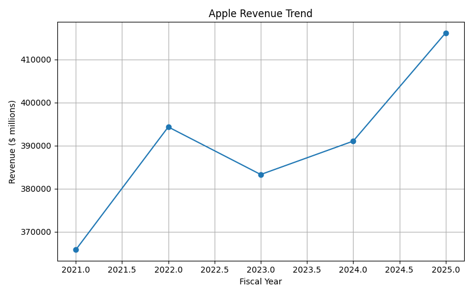
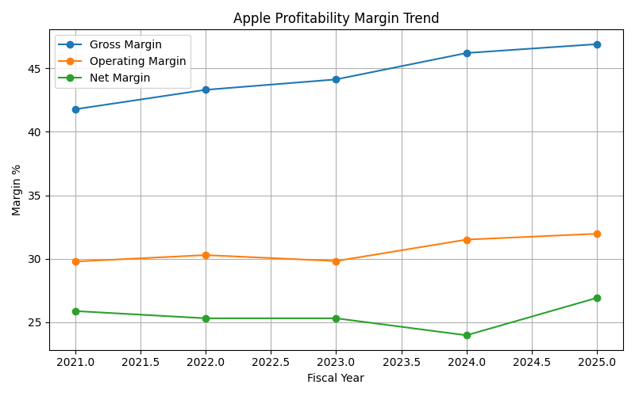
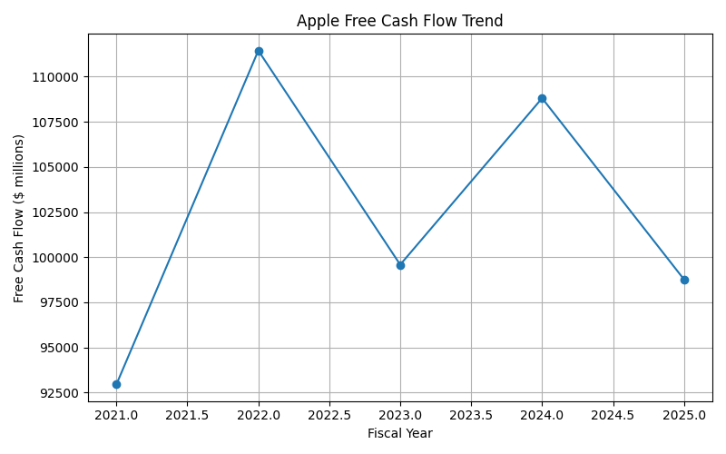
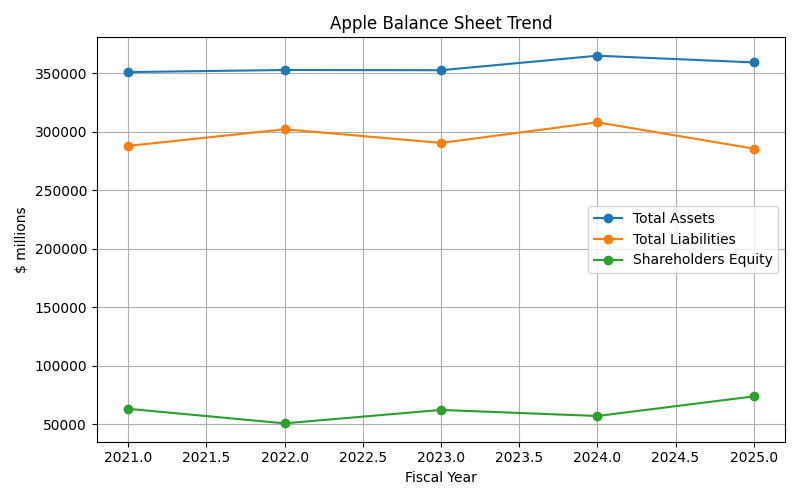
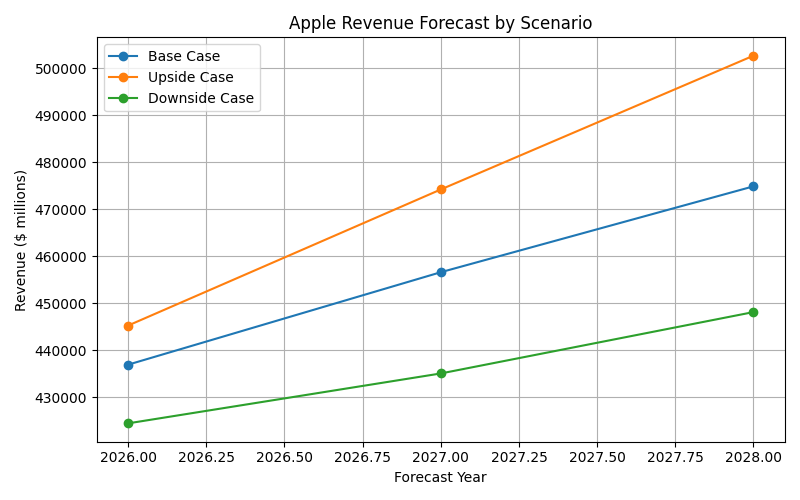
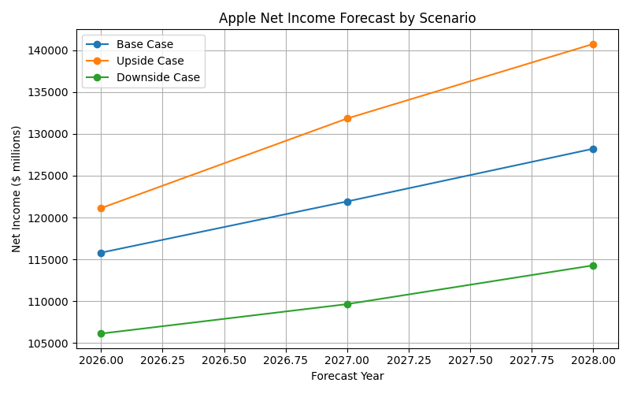
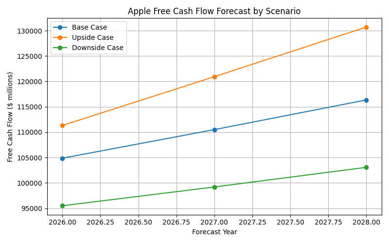

# Apple Financial Analysis & 3-Year Forecast

🔗 **Portfolio Website:** [https://udaybhaskar-23.github.io](https://udaybhaskar-23.github.io)

## Project Overview
This project analyzes Apple Inc.'s historical financial performance using public financial statement data. The analysis focuses on revenue growth, profitability, liquidity, cash flow performance, and a 3-year financial forecast.

## Project Documentation

Detailed project documentation is available in the GitHub Wiki.

- [Wiki Home](../../wiki)
- Project Methodology
- Dashboard Summary
- Forecast Model
- Key Findings
- Data Dictionary
- How to Present This Project

## Business Objective
The goal of this project is to evaluate Apple’s financial health and create an executive-level analysis that supports business decision-making, forecasting, and investment review.

## Key Business Questions
1. Is Apple’s revenue growing consistently?
2. Are profitability margins improving or declining?
3. Is Apple generating strong operating cash flow and free cash flow?
4. Is the balance sheet financially healthy?
5. What is the 3-year financial outlook under base, upside, and downside scenarios?

## Tools Used
- Excel
- Python
- SQL
- Power BI / Tableau
- GitHub

## Planned Analysis
- Revenue trend analysis
- Gross margin, operating margin, and net margin analysis
- Balance sheet ratio analysis
- Cash flow and free cash flow analysis
- 3-year forecast model
- Executive dashboard

## Repository Structure
- data/raw: Original source data
- data/processed: Cleaned financial data
- notebooks: Python notebooks for cleaning and analysis
- excel_model: Financial model and forecast workbook
- dashboard: Power BI or Tableau dashboard files
- visuals: Dashboard screenshots and charts
- report: Final executive summary report

## Final Deliverables
- Cleaned financial dataset
- Excel financial model
- 3-year forecast model
- Dashboard screenshots
- Executive summary report
- Business recommendations

## Current Project Status

The project now includes a cleaned Apple financial dataset, calculated financial ratios, and initial financial performance visuals.

## Key Files Added

* `data/processed/apple_financials_clean.csv`
* `data/processed/apple_financials_with_ratios.csv`
* `notebooks/apple_financial_analysis.py`
* `visuals/revenue_trend.png`
* `visuals/profitability_margins.png`
* `visuals/free_cash_flow_trend.png`
* `visuals/balance_sheet_trend.png`
* `report/initial_financial_insights.md`

## Initial Visual Analysis

### Revenue Trend

### Profitability Margins

### Free Cash Flow Trend

### Balance Sheet Trend

## Initial Findings

Apple’s revenue increased from $365.8B in FY2021 to $416.2B in FY2025. Gross margin improved from 41.8% to 46.9%, showing stronger profitability. Free cash flow remained consistently strong, supporting Apple’s financial flexibility and capacity for shareholder returns.

## Forecast Scenario Analysis

The project includes a 3-year forecast model for FY2026 through FY2028 using base case, upside case, and downside case assumptions.

### Revenue Forecast by Scenario

### Net Income Forecast by Scenario

### Free Cash Flow Forecast by Scenario

## Forecast Methodology

The forecast model starts with Apple’s FY2025 revenue as the baseline and applies scenario-based assumptions for revenue growth, gross margin, operating margin, net margin, capital expenditures, and free cash flow margin.

## Forecast Scenarios

- **Base Case:** Moderate growth with stable margin performance.
- **Upside Case:** Stronger revenue growth, margin expansion, and higher free cash flow conversion.
- **Downside Case:** Slower revenue growth, margin pressure, and lower free cash flow conversion.

## Excel Financial Model

This repository includes a completed Excel financial model:

- `excel_model/apple_financial_analysis_forecast_model.xlsx`

The workbook includes:
- Historical financial statements
- Ratio analysis
- Forecast assumptions
- 3-year forecast output
- Executive dashboard
- Source documentation

## Final Executive Summary

The final executive summary is available here:

- `report/final_executive_summary.md`

## How to Present This Project

This project can be presented as a financial analysis and FP&A portfolio project. It demonstrates the ability to collect financial data, clean and structure datasets, calculate key financial ratios, build forecast scenarios, create visual analysis, and communicate executive-level insights.

## Skills Demonstrated

- Financial statement analysis
- FP&A analysis
- Forecasting and scenario modeling
- Ratio analysis
- Free cash flow analysis
- Excel financial modeling
- Python data analysis
- Data visualization
- Executive reporting
- GitHub project documentation

## Project Status

Completed initial version. Future enhancements may include a Power BI dashboard, benchmarking against peer companies, and DCF valuation analysis.
